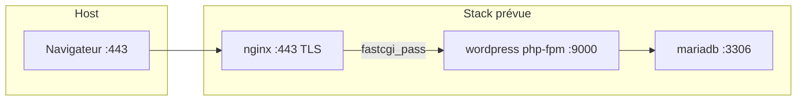
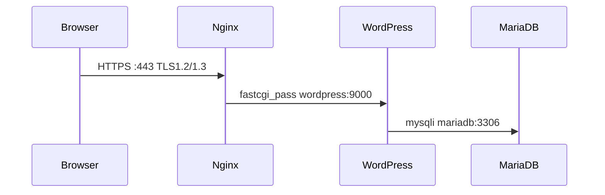

# Plan : container NGINX avec TLS 1.2/1.3

## État actuel du workspace

Projet **42 Inception** dans `alpine-shared/` : une stack WordPress containerisée sur **Alpine 3.22**, orchestrée par Docker Compose.



### Structure des fichiers

| Chemin | Rôle |
|--------|------|
| `srcs/docker-compose.yml` | Orchestration des 3 services |
| `srcs/requirements/mariadb/` | MariaDB — **le plus avancé** |
| `srcs/requirements/wordpress/` | WordPress + PHP-FPM — **WIP** |
| `srcs/requirements/nginx/` | **N'existe pas encore** (seule la déclaration compose est présente) |
| `secrets/` | Mots de passe MariaDB (gitignored) |
| Pas de `Makefile` | Requis par le sujet, absent |

### Ce qui fonctionne déjà

**MariaDB** (`Dockerfile` + `entrypoint.sh`) :
- Image Alpine, init DB, création user/database WordPress
- Secrets Docker pour les mots de passe (pas en clair dans le Dockerfile)
- Healthcheck ajouté dans le compose (non commité)

**WordPress** (`Dockerfile` + `entrypoint.sh`) :
- PHP 8.3 + php-fpm + WP-CLI
- Télécharge et installe WordPress au démarrage
- Lance `php-fpm83 -F` (écoute sur port 9000 par défaut)
- URL configurée : `https://thmaitre.42.fr`

### Ce qui manque ou bloque NGINX

1. **Dossier `requirements/nginx/`** entièrement absent
2. **Pas de réseau Docker** custom — les services ne sont pas isolés comme exigé
3. **Pas de volumes** — les fichiers WordPress ne sont pas partagés entre `wordpress` et `nginx`
4. **Pas de port 443** mappé sur l'hôte
5. **`nginx` sans `depends_on`** wordpress dans le compose
6. **Mot de passe WordPress en dur** dans l'entrypoint (`motdepassdefou`) alors que MariaDB utilise des secrets — à aligner
7. **Pas de certificat TLS** pour `thmaitre.42.fr`
8. **Pas de Makefile**

---

## Architecture cible NGINX

NGINX est le **seul point d'entrée public** :
- Expose **443 uniquement** vers l'hôte
- Termine TLS avec **TLSv1.2 et TLSv1.3 seulement**
- Sert les fichiers statiques WordPress depuis un volume partagé
- Proxie le PHP vers `wordpress:9000` via FastCGI



---

## Implémentation prévue

### 1. Créer le container NGINX

**`srcs/requirements/nginx/Dockerfile`** — suivre le pattern des autres services :

```dockerfile
FROM alpine:3.22

RUN apk update && apk add --no-cache nginx openssl

COPY ./conf/nginx.conf /etc/nginx/http.d/default.conf
COPY ./tools/ /etc/nginx/ssl/
COPY ./conf/entrypoint.sh /tmp/entrypoint.sh
RUN chmod +x /tmp/entrypoint.sh

EXPOSE 443

ENTRYPOINT ["/tmp/entrypoint.sh"]
```

**`srcs/requirements/nginx/conf/entrypoint.sh`** — démarrer nginx en foreground :

```sh
#!/bin/sh
set -e
exec nginx -g "daemon off;"
```

**`srcs/requirements/nginx/conf/nginx.conf`** — points clés :

```nginx
server {
    listen 443 ssl;
    server_name thmaitre.42.fr;

    ssl_protocols TLSv1.2 TLSv1.3;
    ssl_certificate     /etc/nginx/ssl/thmaitre.42.fr.crt;
    ssl_certificate_key /etc/nginx/ssl/thmaitre.42.fr.key;

    root /var/www/wp-site;
    index index.php;

    location / {
        try_files $uri $uri/ /index.php?$args;
    }

    location ~ \.php$ {
        fastcgi_pass wordpress:9000;
        fastcgi_index index.php;
        include fastcgi_params;
        fastcgi_param SCRIPT_FILENAME $document_root$fastcgi_script_name;
    }
}
```

`ssl_protocols TLSv1.2 TLSv1.3;` est la ligne qui satisfait l'exigence du sujet (TLS 1.0/1.1 exclus).

### 2. Certificat TLS auto-signé

Générer via Makefile (voir étape 4) dans `srcs/requirements/nginx/tools/` :

```bash
openssl req -x509 -nodes -days 365 -newkey rsa:2048 \
  -keyout thmaitre.42.fr.key \
  -out thmaitre.42.fr.crt \
  -subj "/CN=thmaitre.42.fr"
```

Les fichiers `.crt` / `.key` peuvent être commités (certificat auto-signé, pas de secret). Alternative : les générer au build dans le Dockerfile avec `openssl` (évite de versionner les certs).

### 3. Mettre à jour docker-compose.yml

Compléter `srcs/docker-compose.yml` :

```yaml
services:
  mariadb:
    # ... existant ...
    networks: [inception]
    volumes:
      - mariadb_data:/var/lib/mysql

  wordpress:
    # ... existant ...
    networks: [inception]
    volumes:
      - wordpress_data:/var/www/wp-site
    # pas de ports exposés à l'hôte

  nginx:
    build: ./requirements/nginx
    container_name: nginx
    depends_on:
      wordpress:
        condition: service_started
    ports:
      - "443:443"
    networks: [inception]
    volumes:
      - wordpress_data:/var/www/wp-site:ro

networks:
  inception:
    driver: bridge

volumes:
  mariadb_data:
    driver: local
    driver_opts:
      type: none
      o: bind
      device: ${DATA_PATH}/mariadb
  wordpress_data:
    driver: local
    driver_opts:
      type: none
      o: bind
      device: ${DATA_PATH}/wordpress
```

Points importants :
- **Seul NGINX** mappe un port vers l'hôte (`443:443`)
- Volume `wordpress_data` **partagé** : RW pour wordpress, RO pour nginx
- Volumes bind-mountés sous `/home/<login>/data/` (convention 42) via variable `${DATA_PATH}` dans un `.env`

### 4. Créer le Makefile

**`Makefile`** à la racine de `alpine-shared/` :

| Cible | Action |
|-------|--------|
| `all` / `build` | `docker compose -f srcs/docker-compose.yml build` |
| `up` | Crée les dossiers data + `docker compose up -d` |
| `down` | `docker compose down` |
| `clean` | `down` + suppression images/volumes (avec confirmation ou flag) |
| `certs` | Génère le certificat dans `nginx/tools/` |
| `re` | `clean` + `all` + `up` |

Exemple minimal :

```makefile
COMPOSE = docker compose -f srcs/docker-compose.yml
DATA    = /home/thmaitre/data

all: certs
	$(COMPOSE) build

up: $(DATA)/mariadb $(DATA)/wordpress
	$(COMPOSE) up -d

certs:
	openssl req -x509 -nodes -days 365 -newkey rsa:2048 \
	  -keyout srcs/requirements/nginx/tools/thmaitre.42.fr.key \
	  -out srcs/requirements/nginx/tools/thmaitre.42.fr.crt \
	  -subj "/CN=thmaitre.42.fr"

$(DATA)/mariadb $(DATA)/wordpress:
	mkdir -p $@
```

### 5. Créer le fichier `.env`

**`srcs/.env`** (gitignored) :

```env
DATA_PATH=/home/thmaitre/data
DOMAIN_NAME=thmaitre.42.fr
```

Référencer dans le compose : `env_file: .env` ou variables `${DATA_PATH}`.

### 6. Ajustements complémentaires (recommandés avant test)

**WordPress entrypoint** — aligner le mot de passe DB avec les secrets MariaDB (lire `/run/secrets/mysql_wp_password` comme MariaDB le fait), sinon WordPress ne pourra pas joindre la DB en prod.

**`/etc/hosts`** sur la machine hôte (ou VM) :

```
127.0.0.1 thmaitre.42.fr
```

Puis accéder à `https://thmaitre.42.fr` (accepter le certificat auto-signé).

---

## Ordre de travail recommandé

- [ ] Créer `requirements/nginx/` (Dockerfile, conf, entrypoint, tools/)
- [ ] Ajouter cible `certs` au Makefile et générer le certificat
- [ ] Compléter `docker-compose.yml` (network, volumes, ports, depends_on)
- [ ] Créer `srcs/.env` avec `DATA_PATH`
- [ ] Corriger le mot de passe WordPress (secrets)
- [ ] `make all && make up`
- [ ] Vérifier : `curl -vk --tlsv1.2 https://thmaitre.42.fr` et `curl -vk --tlsv1.3 https://thmaitre.42.fr`

---

## Vérifications sujet Inception

- Image buildée depuis **Alpine** (pas d'image nginx DockerHub)
- **TLS 1.2/1.3 only** via `ssl_protocols`
- **Port 443 seul** exposé à l'hôte
- Pas de `network: host`, `--link`, ou `links:`
- Container name = service name = `nginx`
- Pas de mot de passe dans les Dockerfiles
- Volumes persistants sur le host
- Réseau bridge custom entre les 3 services
